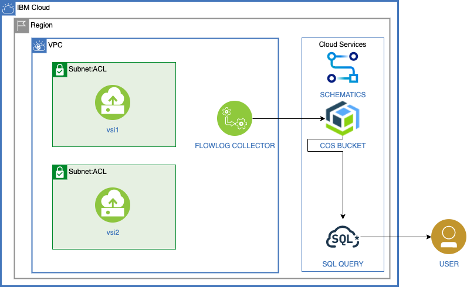

# Analyze VPC Flow Logs using IBM Cloud SQL Query

[Flow logs for VPC](https://cloud.ibm.com/vpc-ext/network/flowLogs) store metadata for the network traffic in Virtual Private Clouds, VPC in Cloud Object Storage (COS) buckets.

[SQL Query](https://cloud.ibm.com/catalog/services/sql-query) allows for running serverless SQL statements on data stored in Cloud Object Storage (COS) buckets. Further you can change the layout of your data through extract transform and load (ETL) statements.

This project shows how use SQL Query to analyze flow logs.



1. The Flow logs for VPC are written to a COS bucket.
1. SQL Query can be used to query the logs

## Deploy the project

> The scripts do not check permissions. You must ensure you have the right permissions:
> - to create service instances,
> - to create vpc resources
> - to create a schematics workspace

1. To run the following scripts you can use the IBM cloud shell.  It has the pre-requisites already installed.
Or use your own computer and make sure to install:
   * [IBM Cloud CLI](https://cloud.ibm.com/docs/cli?topic=cloud-cli-install-ibmcloud-cli)
   * Cloud Object Storage plugin. Install it with `ibmcloud plugin install cloud-object-storage`.
   * Cloud VPC infrastructure plugin. Install it with `ibmcloud plugin install vpc-infrastructure`.
   * Schematics plugin. Install it with `ibmcloud plugin install schematics`.
   * [jq](https://stedolan.github.io/jq/) command line utility

1. Copy the configuration file and set the values to match your environment. At a minimum, set or review the values for `PREFIX`, `RESOURCE_GROUP_NAME`, `REGION` and `TF_VAR_ssh_key_name`.

   ```sh
   cp template.local.env local.env
   edit local.env
   ```

1. Load the values into the current shell.

   ```sh
   source local.env
   ```

1. Ensure you have the prerequisites to run the scripts and initialize the ibmcloud cli.

   ```sh
   ./000-prereqs.sh
   ```

1. Create Cloud Object Storage and SQL Query services.

   ```sh
   ./010-create-services.sh
   ```

   If they do not already exist, the script creates:
      * a Cloud Object Storage service instance and a service key,
      * a storage bucket
      * a SQL Query service instance and a service key.


1. Create a VPC with two instances in the vpc.  The vsi1 is public.  The vsi2 is private and only accesible from vsi1. 

   ```sh
   ./030-create-vpc.sh
   ```

## Cleanup

To delete the services, run:

   ```sh
   ./040-cleanup.sh
   ```
